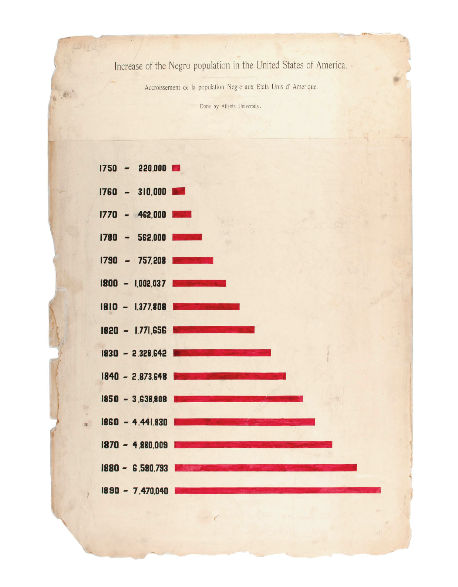

# HW06

##### What dataset did you use? If not from our class site, include a link.
Sleep Health and Lifestyle Dataset
https://www.kaggle.com/datasets/uom190346a/sleep-health-and-lifestyle-dataset?resource=download

##### Why did you choose this dataset?
Sleep is closely related to daily life, and I want to gain a more detailed understanding of the current sleep patterns of young people through this set of data visualizations.

##### Which fields/features/parameters of the dataset did you use?
I used the ID to determine the order and age as supplementary information for labeling. The data is categorized by gender to visualize sleep duration, sleep quality, and stress levels separately.

##### How many data points did you use?
374

##### What are you visualizing? How do the shapes, colors or movement relate to the data values?
I use the width of the rectangles to represent sleep quality, the height to represent sleep duration, the opacity to represent stress levels, and include labels for age.

##### Include drawings and images of reference visualizations

-----------------------------------------------------

### About the CSV file

Add Suggestion
Dataset Columns:

Person ID: An identifier for each individual.
Gender: The gender of the person (Male/Female).
Age: The age of the person in years.
Occupation: The occupation or profession of the person.
Sleep Duration (hours): The number of hours the person sleeps per day.
Quality of Sleep (scale: 1-10): A subjective rating of the quality of sleep, ranging from 1 to 10.
Physical Activity Level (minutes/day): The number of minutes the person engages in physical activity daily.
Stress Level (scale: 1-10): A subjective rating of the stress level experienced by the person, ranging from 1 to 10.
BMI Category: The BMI category of the person (e.g., Underweight, Normal, Overweight).
Blood Pressure (systolic/diastolic): The blood pressure measurement of the person, indicated as systolic pressure over diastolic pressure.
Heart Rate (bpm): The resting heart rate of the person in beats per minute.
Daily Steps: The number of steps the person takes per day.
Sleep Disorder: The presence or absence of a sleep disorder in the person (None, Insomnia, Sleep Apnea).